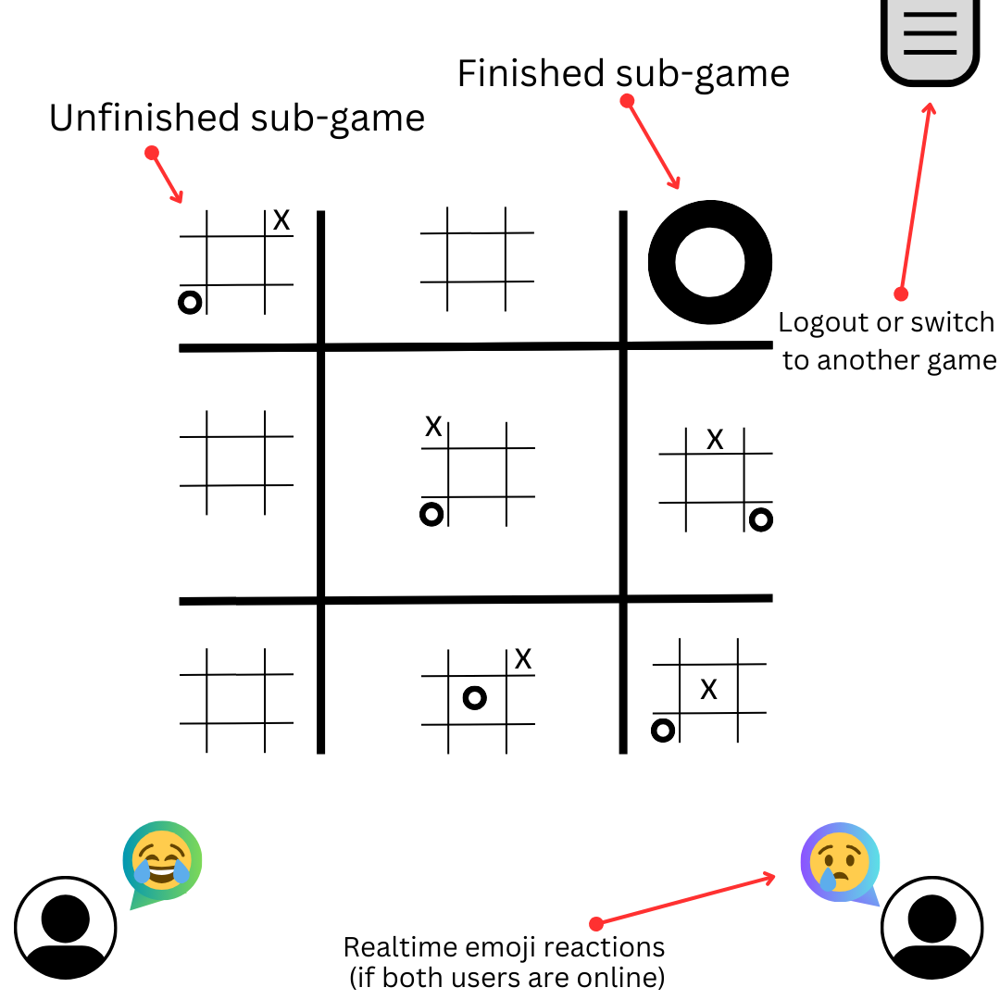
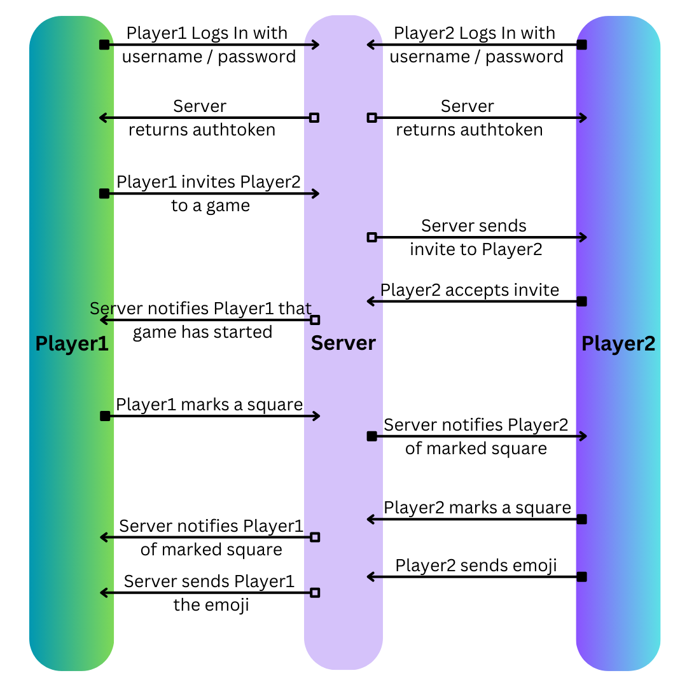

# startup - Recursive Tic-Tac-Toe
Developed by Joseph Fuge, started in September 2023

## Spec/Description Deliverable

### Elevator Pitch

Just about everyone enjoyed a simple game of Tic-Tac-Toe as a child. Unfortunately, its simplicity and limited size means that strategy is limited and its novelty wears off quickly. All of this is remedied with **Recursive Tic-Tac-Toe**, where you can play a game up to three layers deep. Allow me to explain; in order to mark a square on the second layer, you have to win a Tic-Tac-Toe game within that square. Once you win three Tic-Tac-Toe games in a row on the second layer, you have now marked a square on the first layer. Feel free to leave your game and come back later or play it asynchronously when you have a spare moment until you prove your superior Tic-Tac-Toe strategy once and for all.

### Key Features

- User login
- Create games or continue in-progress matches
- Navigate through several layers of tic-tac-toe
- Participate in games asynchronously, advancing them even if only one user is online
- Alternatively, both users can play at the same time through realtime updates
- Send emoji reactions in realtime if both users are present
- User can see how many games they have won total

### Technologies
- HTML; structure of the website including login page, game pages, and score view
- CSS; styling for each page of HTML for an appealing aesthetic
- JavaScript; allows for dynamic functionality and display updates while on a page, communication with server
- Service; web service with endpoints for:
    - authentication
    - fetch in-progress games
    - send in and receive moves for ongoing games
    - create new games
    - allow emojis to be sent and received
- Database; store users, choices, and votes in database
- Login; register and login users, storing credentials in database
- WebSocket; as each user marks squares, their moves are sent to the other user, as are emoji reactions
- React; web framework to facilitate state changes and dynamic updates

### Design

This is what the game screen will look like when the user is actively playing a game of Recursive Tic-Tac-Toe.

The following diagram demonstrates a typical flow of two users logging in and beginning a game with one another.

## HTML Startup Deliverable

During this deliverable I built out the structure of my Recursive TicTacToe startup application in HTML.

**HTML:** Five HTML pages to account for logging in, creating a game, selecting a game, playing a game, and reading about Recursive TicTacToe.

**Links:** The login page links to the about page and to the game select page upon logging in or registering. From the game select page, you can navigate to an existing game or to the game creation page.

**Text Content:** The about page contains a description of Recursive TicTacToe.

**Images:** Added an image to the about page. Otherwise, I elected to use svg icons throughout the website.

**Login:** Username and password text inputs and a submit button for registration and login.

**Database:** The ongoing games will be generated from data pulled from the database.

**WebSocket:** Realtime game changes and emoji reactions on the game screen.

